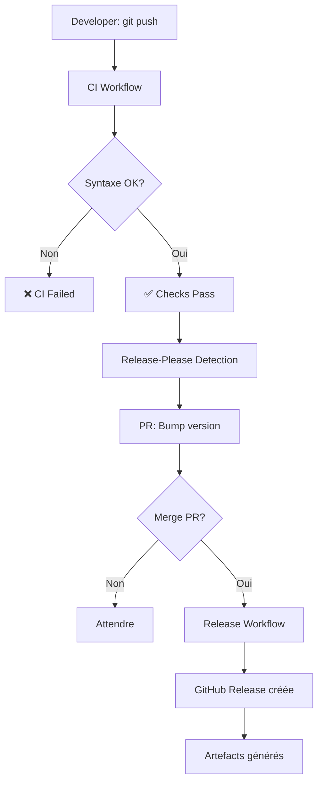

# GitHub Actions Workflows

Cette documentation explique les trois workflows GitHub Actions du projet wsl-ubuntu-bootstrap.

## Structure générale

```
.github/workflows/
├── ci.yml                 # Pipeline de validation (commit)
├── release-please.yml     # Détection des changements sémantiques
└── release.yml            # Création des releases
```

## 1. CI Workflow (ci.yml)

**Trigger** : À chaque push sur main, PR, ou déclenchement manuel

### Étapes

1. **Pre-commit Checks**

   * Installe les hooks pre-commit
   * Valide : YAML, Shell, Secrets, Markdown
   * Fail fast si erreur détectée

   Outils exécutés :
   * `yamllint` - Validation YAML (120 char max)
   * `shellcheck` - Analyse statique shells
   * `detect-secrets` - Détection fuites (25+ patterns)
   * `markdownlint` - Validation markdown

2. **Ansible Lint**

   Analyse statique du playbook Ansible (production profile)

   Vérifie :
   * Noms de tâches significatifs
   * Noms de variables cohérents (format snake_case, préfixes)
   * Étiquetage des tâches
   * Syntaxe YAML propre

3. **Ansible Syntax Check**

   Valide la syntaxe du playbook principal sans exécution

   Commande :

   ```bash
   ansible-playbook main.yml --syntax-check
   ```

4. **Ansible Dry-run (Check Mode)**

   Simule l'exécution **sans apporter de changements**

   Permet de vérifier :
   * Réponses de modules (registres)
   * Conditions (when)
   * Gestionnaires (handlers)

   Commande :

   ```bash
   ansible-playbook main.yml --check -i localhost, --connection=local
   ```

5. **SonarCloud Version Validation**

   Valide que `sonar-project.properties` correspond à la dernière version du CHANGELOG

   Prévient les désynchronisations lors des releases

   Exécute :

   ```bash
   bash .github/scripts/validate-sonar-version.sh
   ```

6. **SonarCloud Scan** ☁️

   Envoie le code vers SonarCloud pour analyse

   Métriques scannées :
   * Couverture de code (n/a pour Ansible)
   * Duplications
   * Code smell
   * Hotspots de sécurité

   Connexion sécurisée via `SONAR_TOKEN` (secret)

   Organisation : `jasonouellet`

7. **CodeQL Scan** 🧭

   Analyse CodeQL et export SARIF

   Résultats :
   * Upload vers GitHub Code Scanning
   * Import SARIF dans SonarCloud (external issues)

8. **Trivy Security Scan** 🔍

   Scanne les vulnérabilités et les secrets

   **Modes** :
   * `rootfs` - Fichiers du système
   * `fs` - Système de fichiers complet
   * `config` - Fichiers de configuration (Ansible, Docker, etc.)

   **Sorties** :
   * Table éditable en console
   * Rapport SARIF (GitHub Security tab)
   * Sortie brute (logs)

9. **SBOM Generation** 📋

   Génère un Bill of Materials (SBOM) avec Syft

   **Formats** supportés :
   * CycloneDX (JSON) - Recommandé
   * SPDX (JSON/XML) - Standard ISO
   * Tableau (console)

   **Artifact** :
   * Stocké pendant 30 jours
   * Accessible dans Actions > Summary

10. **Upload Artifacts**

   Stocke les SBOM pour inspection

   Artefacts disponibles : `sbom-cyclonedx.json` (Format CycloneDX), `sbom-spdx-json.json` (Format SPDX)

### Secrets requis

| Secret | Usage | Où créer |
| --- | --- | --- |
| `GITHUB_TOKEN` | Authentification GitHub (fourni automatiquement) | ✅ Auto |
| `SONAR_TOKEN` | Authentification SonarCloud | Settings > Secrets > Actions |

### Durée typique

* **Pre-commit checks** : 30-60 sec
* **Ansible lint** : 10 sec
* **Ansible check** : 1-2 min
* **CodeQL scan** : 1-3 min
* **SonarCloud scan** : 1-2 min
* **Trivy scan** : 30 sec
* **SBOM generation** : 15 sec

**Total** : ~5-6 minutes

## 2. Release Please Workflow (release-please.yml)

**Trigger** : À chaque push sur main (si changements détectés)

### Objectif

Automatise la versionning sémantique (SemVer) via **Release Please**

### Processus

1. **Détecte les changements** basés sur les messages de commit

   Conventionnel Commits :
   * `feat:` → Version mineure (1.0.x → 1.1.0)
   * `fix:` → Version patch (1.0.0 → 1.0.1)
   * `feat!:` → Version majeure (1.0.0 → 2.0.0)

2. **Crée une PR de release**

   Titre : "chore(main): release 1.0.0"

   Contient :
   * Mise à jour du CHANGELOG.md
   * Incrémentation de version dans sonar-project.properties (auto-sync)

3. **Attend la fusion**

   La PR reste ouverte jusqu'à fusion manuelle

   Cela permet :
   * Révision des changements
   * Vérification du CHANGELOG
   * Validation du numéro de version

### Configuration

Clé pour action : `google-github-actions/release-please-action@v4`

Paramètres :

| Param | Valeur | But |
| --- | --- | --- |
| `release-type` | `simple` | Un seul numéro de version pour tout le projet |
| `default-branch` | `main` | Branche de reference |
| `changelog-types` | Custom | Groupage des commits dans le CHANGELOG |

### Résultat

PR générée automatiquement :

```diff
# CHANGELOG.md
## [1.0.0] - 2024-01-15

### Added
- feat: SonarCloud integration (#45)
- feat: Trivy security scanning (#46)

### Fixed
- fix: Terraform APT cache issue (#43)
```

## 3. Release Workflow (release.yml)

**Trigger** : Création d'une release (tag avec format `v*`)

### Publishing Artifact

Publie une release GitHub avec artefacts

### Release Steps

1. **Créer la release** via GitHub UI

   * Menu : Release → Draft new release
   * Tag : `v1.0.0`
   * Title : `Release 1.0.0`
   * Description : Contenu du CHANGELOG.md

2. **Workflow s'exécute automatiquement**

   Effectue :
   * Récupère le code du tag
   * Génère les artefacts (SBOM, etc.)
   * Attache les fichiers à la release

3. **Release visible dans**

   * Page Releases du repo
   * Page PyPI (si package Python)
   * Flux RSS

### Artefacts générés

```
Release v1.0.0
├── sbom-cyclonedx.json
├── sbom-spdx-json.json
└── Source code (zip, tar.gz) [Auto par GitHub]
```

## Architecture complète

### Flux de changement



### Secrets et permissions

| Composant | Secret | Scope | Créé par | Usage |
| --- | --- | --- | --- | --- |
| **SonarCloud** | `SONAR_TOKEN` | Organization | SonarCloud UI | Authentification scan |
| **GitHub Actions** | `GITHUB_TOKEN` | Repository | ✅ Auto | Push SBOM, commentaires PR |
| **CD** | N/A | ✅ Auto | GitHub | Création releases |

**Grant requis** : Workflows have `contents: read` (lisent le code), `actions: read` (lisent les artifacts)

## Déploiement sur d'autres branches

Pour déployer sur branches autres que `main` :

1. Ajouter `branches` au trigger des workflows

   ```yaml
   on:
     push:
       branches:
         - main
         - develop
   ```

2. Configurer Release-Please pour chaque branche

   ```yaml
   release-type: simple
   target-branch: develop  # Si nécessaire
   ```

3. Créer stratégie de merge (rebase sur main après release)

## Troubleshooting

### CI échoue avec "lsb_release not found"

**Cause** : Distribution detection manquante

**Solution** :

```bash
Toutes les roles utilisent:
- ansible.builtin.command: lsb_release -cs
  register: distro_result
```

### SonarCloud scan timeout

**Cause** : Project trop gros ou réseau lent

**Solution** : Ajouter timeout dans la configuration

```yaml
SONAR_HOST_URL: "https://sonarcloud.io"
SONAR_TIMEOUT: "300"
```

### Release-Please crée version incorrecte

**Cause** : Commits non-conventionnels

**Solution** : Utiliser format Conventional Commits

```bash
git commit -m "feat: add new feature"      # Minor version bump
git commit -m "fix: correct bug"           # Patch version bump
git commit -m "feat!: breaking change"     # Major version bump
```

### SBOM artifacts ne se téléchargent pas

**Cause** : Artifact expiration (30 jours par défaut)

**Solution** : Télécharger depuis Actions avant expiration

Menu : Actions > Latest run > Summary section

## Bonnes pratiques

### À FAIRE

* Utiliser **Conventional Commits** pour tous les commits
* Réviser les **PRs de Release Please** avant merge
* Tester localement avec `--check` avant push
* Vérifier les **security tabs** après CI

### À ÉVITER

* Pousser directement sans CI (by-pass dangerous)
* Utiliser des messages de commit vagues
* Ignorer les **alertes Trivy**
* Créer des releases manuelles (Release-Please gère tout)

## Ressources

* [GitHub Actions Documentation](https://docs.github.com/en/actions)
* [Release Please Action](https://github.com/google-github-actions/release-please-action)
* [Conventional Commits](https://www.conventionalcommits.org/)
* [Trivy Documentation](https://aquasecurity.github.io/trivy/)
* [SonarCloud Documentation](https://docs.sonarcloud.io/)
