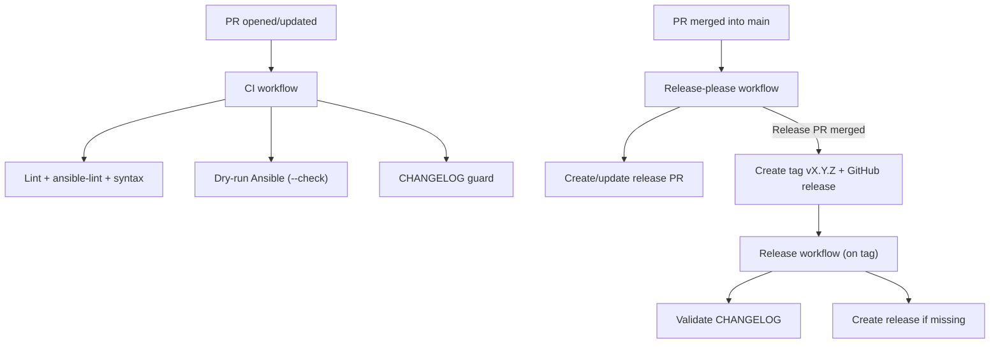

# GitHub Actions Workflows

This documentation explains the three GitHub Actions workflows in the wsl-ubuntu-bootstrap project.

## General structure

```
.github/workflows/
├── ci.yml                 # Validation pipeline (commit)
├── release-please.yml     # Semantic change detection
└── release.yml            # Release creation
```

## 1. CI Workflow (ci.yml)

**Trigger**: On every push to main, on PRs, or manual trigger

### Steps

1. **Pre-commit Checks**

   * Installs pre-commit hooks
   * Validates: YAML, Shell, Secrets, Markdown
   * Fail fast if an error is detected

   Tools executed:
   * `yamllint` - YAML validation (120 char max)
   * `shellcheck` - Shell static analysis
   * `detect-secrets` - Leak detection (25+ patterns)
   * `markdownlint` - Markdown validation

2. **Ansible Lint**

   Static analysis of the Ansible playbook (production profile)

   Checks:
   * Meaningful task names
   * Consistent variable names (snake_case, prefixes)
   * Task tagging
   * Clean YAML syntax

3. **Ansible Syntax Check**

   Validates the main playbook syntax without execution

   Command:

   ```bash
   ansible-playbook main.yml --syntax-check
   ```

4. **Ansible Dry-run (Check Mode)**

   Simulates execution **without making changes**

   Verifies:
   * Module responses (registers)
   * Conditions (when)
   * Handlers

   Command:

   ```bash
   ansible-playbook main.yml --check -i localhost, --connection=local
   ```

5. **SonarCloud Version Validation**

   Validates that `sonar-project.properties` matches the latest CHANGELOG version

   Prevents release desynchronization

   Runs:

   ```bash
   bash .github/scripts/validate-sonar-version.sh
   ```

6. **SonarCloud Scan**

   Sends code to SonarCloud for analysis

   Metrics scanned:
   * Code coverage (n/a for Ansible)
   * Duplications
   * Code smells
   * Security hotspots

   Secure auth via `SONAR_TOKEN` (secret)

   Organization: `jasonouellet`

7. **CodeQL Scan**

   Runs CodeQL analysis and exports SARIF

   Results:
   * Upload to GitHub Code Scanning
   * SARIF import into SonarCloud (external issues)

8. **Trivy Security Scan**

   Scans vulnerabilities and secrets

   **Modes**:
   * `rootfs` - System files
   * `fs` - Full filesystem
   * `config` - Config files (Ansible, Docker, etc.)

   **Outputs**:
   * Table output in console
   * SARIF report (GitHub Security tab)
   * Raw output (logs)

9. **SBOM Generation**

   Generates a Bill of Materials (SBOM) with Syft

   Supported formats:
   * CycloneDX (JSON) - Recommended
   * SPDX (JSON/XML) - ISO standard
   * Table (console)

   **Artifact**:
   * Stored for 30 days
   * Available in Actions > Summary

10. **Upload Artifacts**

   Stores SBOMs for inspection

   Artifacts available: `sbom-cyclonedx.json` (CycloneDX format), `sbom-spdx-json.json` (SPDX format)

### Required secrets

| Secret | Usage | Where to create |
| --- | --- | --- |
| `GITHUB_TOKEN` | GitHub authentication (auto provided) | Auto |
| `SONAR_TOKEN` | SonarCloud authentication | Settings > Secrets > Actions |

### Typical duration

* **Pre-commit checks**: 30-60 sec
* **Ansible lint**: 10 sec
* **Ansible check**: 1-2 min
* **CodeQL scan**: 1-3 min
* **SonarCloud scan**: 1-2 min
* **Trivy scan**: 30 sec
* **SBOM generation**: 15 sec

**Total**: ~5-6 minutes

## 2. Release Please Workflow (release-please.yml)

**Trigger**: On every push to main (if changes are detected)

### Goal

Automates semantic versioning (SemVer) via **Release Please**

### Process

1. **Detects changes** based on commit messages

   Conventional Commits:
   * `feat:` -> Minor version (1.0.x -> 1.1.0)
   * `fix:` -> Patch version (1.0.0 -> 1.0.1)
   * `feat!:` -> Major version (1.0.0 -> 2.0.0)

2. **Creates a release PR**

   Title: "chore(main): release 1.0.0"

   Contains:
   * Update to CHANGELOG.md
   * Version bump in sonar-project.properties (auto sync)

3. **Waits for merge**

   The PR remains open until manually merged

   This allows:
   * Change review
   * CHANGELOG verification
   * Version number validation

### Configuration

Action key: `google-github-actions/release-please-action@v4`

Parameters:

| Param | Value | Purpose |
| --- | --- | --- |
| `release-type` | `simple` | Single version number for the project |
| `changelog-path` | `CHANGELOG.md` | Use the project changelog |
| `include-v-in-tag` | `true` | Tags are `vX.Y.Z` |

### Result

Automatically generated PR:

```diff
# CHANGELOG.md
## [1.0.0] - 2024-01-15

### Added
- feat: SonarCloud integration (#45)
- feat: Trivy security scanning (#46)

### Fixed
- fix: Terraform APT cache issue (#43)
```

## 3. Release Workflow (release.yml)

**Trigger**: Tag push with format `vX.Y.Z` or manual `workflow_dispatch`

### Publishing

Creates or completes a GitHub release from a tag, using the changelog

### Release Steps

1. **Validate CHANGELOG**

   Ensures CHANGELOG.md was updated for the new tag (or since the last tag on manual run)

2. **Create release if missing**

   * Checks if a GitHub release already exists for the tag
   * Creates the release only when missing
   * Uses CHANGELOG.md as the release body

3. **Release visible in**

   * Releases page of the repo
   * RSS feed

### Generated artifacts

```
Release v1.0.0
└── Source code (zip, tar.gz) [Auto by GitHub]
```

## Full architecture

### Change flow



### Secrets and permissions

| Component | Secret | Scope | Created by | Usage |
| --- | --- | --- | --- | --- |
| **SonarCloud** | `SONAR_TOKEN` | Organization | SonarCloud UI | Scan authentication |
| **GitHub Actions** | `GITHUB_TOKEN` | Repository | Auto | Push SBOM, PR comments |
| **CD** | N/A | Auto | GitHub | Release creation |

**Required grants**: CI uses `contents: read`; release workflows require `contents: write` to create tags and releases, and `pull-requests: write` for Release Please.

## Deploying on other branches

To deploy on branches other than `main`:

1. Add `branches` to workflow triggers

   ```yaml
   on:
     push:
       branches:
         - main
         - develop
   ```

2. Configure Release Please for each branch

   ```yaml
   release-type: simple
   target-branch: develop  # If needed
   ```

3. Create a merge strategy (rebase onto main after release)

## Troubleshooting

### CI fails with "lsb_release not found"

**Cause**: Missing distribution detection

**Solution**:

```bash
All roles use:
- ansible.builtin.command: lsb_release -cs
  register: distro_result
```

### SonarCloud scan timeout

**Cause**: Project too large or slow network

**Solution**: Add timeout in configuration

```yaml
SONAR_HOST_URL: "https://sonarcloud.io"
SONAR_TIMEOUT: "300"
```

### Release Please creates an incorrect version

**Cause**: Non-conventional commits

**Solution**: Use Conventional Commits format

```bash
git commit -m "feat: add new feature"      # Minor version bump
git commit -m "fix: correct bug"           # Patch version bump
git commit -m "feat!: breaking change"     # Major version bump
```

### SBOM artifacts do not download

**Cause**: Artifact expiration (30 days by default)

**Solution**: Download from Actions before expiration

Menu: Actions > Latest run > Summary section

## Best practices

### Do

* Use **Conventional Commits** for all commits
* Review **Release Please PRs** before merge
* Test locally with `--check` before push
* Check **security tabs** after CI

### Avoid

* Pushing directly without CI (bypass is risky)
* Using vague commit messages
* Ignoring **Trivy alerts**
* Creating manual releases (Release Please and the tag workflow handle it)

## Resources

* [GitHub Actions Documentation](https://docs.github.com/en/actions)
* [Release Please Action](https://github.com/google-github-actions/release-please-action)
* [Conventional Commits](https://www.conventionalcommits.org/)
* [Trivy Documentation](https://aquasecurity.github.io/trivy/)
* [SonarCloud Documentation](https://docs.sonarcloud.io/)
