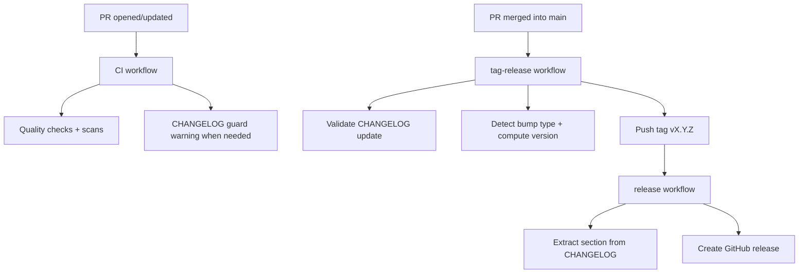

# GitHub Actions Workflows

This document describes the current CI/CD workflows used in this repository.

## General structure

```text
.github/workflows/
├── ci.yml            # Validation, linting, security scans
├── tag-release.yml   # Version calculation + tag creation on main
└── release.yml       # GitHub release publication from tags
```

## 1. CI Workflow (ci.yml)

**Trigger**:

* Push on `main`
* Pull requests targeting `main`
* Manual trigger (`workflow_dispatch`)

### Main responsibilities

1. Run quality checks (`pre-commit`, `ansible-lint`, syntax, dry-run)
2. Run security scanning (Trivy, CodeQL, SonarCloud)
3. Generate and publish SBOM artifacts
4. Validate releasable changes against `CHANGELOG.md` with a non-blocking warning

### CHANGELOG guard behavior

CI inspects the relevant commit range:

* `pull_request`: `origin/<base>..HEAD`
* `push`: `${{ github.event.before }}..${{ github.sha }}` (fallback to `${{ github.sha }}`)

Then it detects releasable commits:

* `feat:`
* `feat!:`
* `fix:`
* `BREAKING CHANGE:`

If releasable commits exist and `CHANGELOG.md` is not modified, CI emits a warning annotation at the end of the job:

```text
::warning title=CHANGELOG not updated::...
```

This warning is intentionally non-blocking.

## 2. Tag Workflow (tag-release.yml)

**Trigger**:

* Push on `main`
* Manual trigger (`workflow_dispatch`)

### Release Publication Goal

Automatically create a semantic version tag when release prerequisites are met.

### Release Publication Process

1. Verify `CHANGELOG.md` changed since last tag (or exists for first release)
2. Detect intended bump type from commits in range:
   * `feat!:` or `BREAKING CHANGE:` -> `major`
   * `feat:` -> `minor`
   * otherwise -> `patch`
3. Calculate semantic version with GitVersion
4. Skip if tag already exists
5. Create and push `vX.Y.Z`

### Versioning rules

Configured in `GitVersion.yml`:

* `major-version-bump-message`: `feat!:` or `BREAKING CHANGE:`
* `minor-version-bump-message`: `feat:`
* `patch-version-bump-message`: `fix:`

## 3. Release Workflow (release.yml)

**Trigger**:

* Tag push matching `vX.Y.Z`
* Manual trigger (`workflow_dispatch`)

### Goal

Publish a GitHub release from an existing version tag.

### Process

1. Validate that `CHANGELOG.md` was updated for the release range
2. Extract version from the tag
3. Extract only the matching version section from `CHANGELOG.md`
4. Check whether the GitHub release already exists
5. Create release when missing

Release body content is scoped to the tagged version section, not the full changelog.

## Architecture overview


```mermaid
flowchart TD
  A[PR opened/updated] --> B[CI workflow]
  B --> B1[Quality checks + scans]
  B --> B2[CHANGELOG guard warning when needed]

  C[PR merged into main] --> D[tag-release workflow]
  D --> D1[Validate CHANGELOG update]
  D --> D2[Detect bump type + compute version]
  D --> D3[Push tag vX.Y.Z]

  D3 --> E[release workflow]
  E --> E1[Extract section from CHANGELOG]
  E --> E2[Create GitHub release]
```

## Secrets and permissions

| Component | Secret | Scope | Usage |
| --- | --- | --- | --- |
| SonarCloud | `SONAR_TOKEN` | Repository/Org | SonarCloud scan authentication |
| GitHub Actions | `GITHUB_TOKEN` | Auto-provided | Tag push and release creation |

Permission model:

* `ci.yml`: mostly `contents: read`, `security-events: write`
* `tag-release.yml`: `contents: write` (required to push tags)
* `release.yml`: `contents: write` (required to create GitHub releases)

## Troubleshooting

### No tag created on main

Common causes:

* `CHANGELOG.md` was not modified since the latest tag
* Tag already exists for the computed version
* Commit history does not match bump patterns

### Incorrect bump level

Check commit messages against expected patterns:

* `feat: ...` -> minor
* `fix: ...` -> patch
* `feat!: ...` or `BREAKING CHANGE: ...` -> major

### Release not created from tag

Verify:

* Tag matches `vX.Y.Z`
* Workflow has `contents: write`
* Release for that tag does not already exist

## Resources

* [GitHub Actions Documentation](https://docs.github.com/en/actions)
* [GitVersion Documentation](https://gitversion.net/docs/)
* [Conventional Commits](https://www.conventionalcommits.org/)
* [Trivy Documentation](https://aquasecurity.github.io/trivy/)
* [SonarCloud Documentation](https://docs.sonarcloud.io/)
