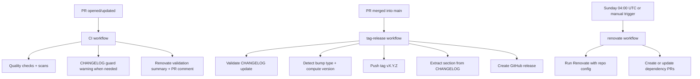

# GitHub Actions Workflows

This document describes the current CI/CD workflows used in this repository.

## General structure

```text
.github/workflows/
├── ci.yml            # Validation, linting, security scans, Renovate validation summary
├── renovate.yml      # Weekly and manual dependency update execution (Renovate)
└── tag-release.yml   # Version calculation, tagging, and GitHub release on main
```

## 1. CI Workflow (ci.yml)

**Trigger**:

* Push on `main`
* Pull requests targeting `main`
* Manual trigger (`workflow_dispatch`)

### Workflow responsibilities

1. Run quality checks (`pre-commit`, `ansible-lint`, syntax, dry-run)
2. Run security scanning (Trivy, CodeQL, SonarCloud)
3. Generate and publish SBOM artifacts
4. Validate releasable changes against `CHANGELOG.md` with a non-blocking warning
5. Validate Renovate configuration and print a markdown summary table
6. Post/update Renovate validation summary as PR comment for pull requests

### CHANGELOG guard behavior

CI inspects the relevant commit range:

* `pull_request`: `${{ github.event.pull_request.base.sha }}..${{ github.event.pull_request.head.sha }}`
* `push`: `${{ github.event.before }}..${{ github.sha }}` (fallback to `${{ github.sha }}`)

Then it detects releasable commits:

* `feat:`
* `feat!:`
* `fix:`
* `BREAKING CHANGE:`

If releasable commits exist and `CHANGELOG.md` is not modified, CI emits a warning annotation at the end of the job:

```text
::warning title=CHANGELOG not updated::...
```

This warning is intentionally non-blocking.

## 2. Tag Workflow (tag-release.yml)

**Trigger**:

* Push on `main`
* Manual trigger (`workflow_dispatch`)

### Release Publication Goal

Automatically create a semantic version tag when release prerequisites are met.

### Release Publication Process

1. Verify `CHANGELOG.md` changed since last tag (or exists for first release)
2. Detect intended bump type from commits in range:
   * `feat!:` or `BREAKING CHANGE:` -> `major`
   * `feat:` -> `minor`
   * otherwise -> `patch`
3. Calculate semantic version with GitVersion
4. Validate that `CHANGELOG.md` contains the exact calculated version heading (`## [X.Y.Z]`)
5. Skip if tag already exists
6. Create and push `vX.Y.Z`
7. Create GitHub release if it does not already exist

## 3. Dependency Update Workflow (renovate.yml)

**Trigger**:

* Weekly schedule: Sunday at 04:00 UTC
* Manual trigger (`workflow_dispatch`)

### Main responsibilities

1. Run Renovate with repository config (`.renovaterc.json`)
2. Create/update dependency branches and pull requests
3. Keep updates grouped and reviewed through normal PR workflow

### Security controls

* Renovate container image is pinned by immutable digest
* Workflow uses explicit timeout and concurrency controls
* Token scope is limited to workflow permissions (`contents`, `pull-requests`, `issues`)

### Renovate validation in CI

The `renovate-validate` job in `ci.yml` runs Renovate in local dry-run mode and publishes:

* A markdown table in the workflow job summary
* A `renovate-validation` artifact (`renovate-local.log` + summary)
* A PR comment update (idempotent) when the event is `pull_request`

### Versioning rules

Configured in `GitVersion.yml`:

* `major-version-bump-message`: `feat!:` or `BREAKING CHANGE:`
* `minor-version-bump-message`: `feat:`
* `patch-version-bump-message`: `fix:`

## Architecture overview


```mermaid
flowchart TD
  A[PR opened/updated] --> B[CI workflow]
  B --> B1[Quality checks + scans]
  B --> B2[CHANGELOG guard warning when needed]
  B --> B3[Renovate validation summary + PR comment]

  C[PR merged into main] --> D[tag-release workflow]
  D --> D1[Validate CHANGELOG update]
  D --> D2[Detect bump type + compute version]
  D --> D3[Push tag vX.Y.Z]
  D --> D4[Extract section from CHANGELOG]
  D --> D5[Create GitHub release]

  E[Sunday 04:00 UTC or manual trigger] --> F[renovate workflow]
  F --> F1[Run Renovate with repo config]
  F --> F2[Create or update dependency PRs]
```

## Secrets and permissions

| Component | Secret | Scope | Usage |
| --- | --- | --- | --- |
| SonarCloud | `SONAR_TOKEN` | Repository/Org | SonarCloud scan authentication |
| GitHub Actions | `GITHUB_TOKEN` | Auto-provided | Tag push and release creation |
| Renovate (workflow) | `GITHUB_TOKEN` | Auto-provided | Renovate PR/branch operations in GitHub platform mode |

Permission model:

* `ci.yml`: mostly `contents: read`, `security-events: write`
* `tag-release.yml`: `contents: write` (required to push tags and create GitHub releases)
* `renovate.yml`: `contents: write`, `pull-requests: write`, `issues: write`

## Troubleshooting

### No tag created on main

Common causes:

* `CHANGELOG.md` was not modified since the latest tag
* `CHANGELOG.md` does not contain the exact calculated version heading
* Tag already exists for the computed version
* Commit history does not match bump patterns

### Incorrect bump level

Check commit messages against expected patterns:

* `feat: ...` -> minor
* `fix: ...` -> patch
* `feat!: ...` or `BREAKING CHANGE: ...` -> major

### Release not created on main merge

Verify:

* `tag-release.yml` run succeeded on `main`
* Workflow has `contents: write`
* `CHANGELOG.md` includes the version heading
* Release for that tag does not already exist

## Resources

* [GitHub Actions Documentation](https://docs.github.com/en/actions)
* [GitVersion Documentation](https://gitversion.net/docs/)
* [Conventional Commits](https://www.conventionalcommits.org/)
* [Trivy Documentation](https://aquasecurity.github.io/trivy/)
* [SonarCloud Documentation](https://docs.sonarcloud.io/)
